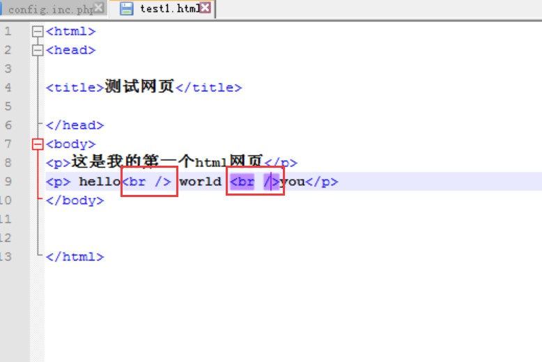
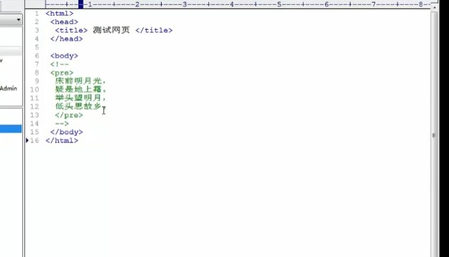

[TOC]

```
<html>
<head>

<title>测试网页</title>

</head>
<body>
这是我的第一个html网页
</body>


</html>

```
另存为html格式;


右击查看源代码:


下面讲body里面的:


## 分段:（两段之间有空行）


## 换行标签:(两行之间没有空行)





## 原样输出标签:


## 注释:





## 图片:


```

```
这里面表示了一个相对路径`/image/1.jpg`表示根目录(这里指的是www这个文件夹)下面的image文件夹下面的1.jpg这个图片


## 超链接

href属性指定url；
以上面图里面的例子为例:将文字描述这4个字嵌入网页里面,一点这四个字,就跳转至url所指定的页面;

图像超链接:


## 表单
场景:登录界面


表单用于接收用户输入的数据,再将其发送给服务器,表单包括文本框和按钮;表单有一些子标签（最常用的是input标签）,每个子标签 又能实现一些功能;
action属性后面跟一个页面,“UserLogin.php”，这个页面的作用是接收通过表单传给服务器的数据,（表单作用是接收数据传给服务器),数据传给服务器以后谁来处理这些数据,所以这里定义了一个动态的 php页面,由这个页面来验证用户名和密码是否正确(一般需要用户名和密码的,用户名和密码在服务端那边判断是否正确);

method是方法,你要通过什么方法把表单的数据传给服务器,客户端传数据给服务端的方法一般有两种, get和post(传输数据量大用post，一般表单用post),一般传给服务器的数据在url显示出来的是get(会有 一个？,比如？username=...),而post传出的数据是在地址栏里面看不到的(5")

(表单主要是一些文本框和按钮)

input标签可以用来实现文本框,也可以实现按钮,是什么类型的需要看后面的type,text类型的是一个文本框,username是给用户名冒号后面的文本框定义的一个名字;why?我们输入的信息都需要传给UserLogin.php这个网页页面去处理(在这个例子里面);UserLogin.php这个网在一上来就要接受通过表单传给它的数据,接受的时候怎么知道那个数据是用户名,密码,那么从name是username文本框传过来的数据就是用户名,从名字是password的文本框传过来的数据就是密码;所以必须给每个文本框起个名字,这样接收方在服务器那儿接受的时候就能区分!
第三行是一个提交的按钮,一点这个按钮,数据就传出去了,这里提交按钮的名字叫submit,名字可以随便起,但是类型的确定的(这里有text，password,submit三种类型)!
submit显示出来的文字就是value的值:(value后面是什么,后面按钮上面就显示什么)


&nbsp 代表一个空格:
下图表示两个按钮之间有三个空格;


重置按钮功能是把名字和密码清0,服务器那里不接受他的数据,所以这里的名字有没有无所谓的!但是value必须有！
## 浮动框架
可以在一个页面里面显示其他网页的内容!


这里面的宽度和高度是自己定义的;
这种方式可以网页挂马,可以把木马放在服务器上,src后面的url可以是木马的地址;把木马的地址以iframe的方式插入到正常的网页里面;人家一访问这个网页,就会主动访问木马网页,把木马页面设置一下，让其一访问就自动下载木马,可以将其高度和宽度设置为0,在设置frameborder=0即边线为0


