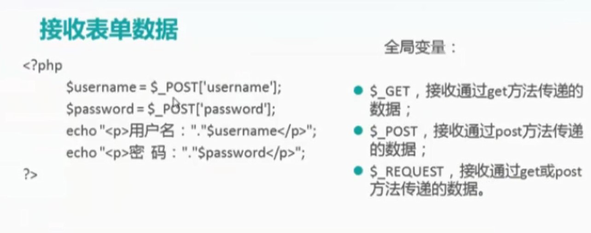

[TOC]


php可以插入在html页面里面,
以`?php`开始,以`?`结束
每行代码必须 以分号结尾;echo是php里面的输出函数;
之前的test1.html是静态页面,不管将其存放于 哪儿,都可以双击它打开它，php是一个动态页面,直接双击是不行的,必须将其放到网站的主目录里面,这里将其放至www目录下面,而后通过浏览器访问,它是一个动态页面,只能在服务器 端执行!执行完了以后把页面反馈给客户端的浏览器而后显示


这里是看不到其源代码,这就是动态和静态的差别了,动态语言在服务器端执行其代码,在客户端这儿是没有办法看到后台的源代码的,前端可以在客户端直接改源代码,后端语言一般你看都看不到！

## 变量

- 变量以$符号开头,变量名对大小写敏感;
- 可以直接通过赋值来指定变量类型
- 双引号里面的变量会被解析执行;（双面代码里面的a和b会被解析的2,3）
- 点号.用于连接字符串


### 输出HTML文本
```

<?php
    $a = 2;
    $b = 3;
    $c = 5;
    echo "<h1>$a + $b = "."$c</h1>"

?>
```


### 单引号和双引号区别


单引号会原样输出,双引号会解析;

双引号里面有单引号的时候也会解析变量;
只要用引号引起来的 都是文本型的数据(被当做字符串！！！)!!!;
文本型注入你输入的一些语句,是并且包含在单引号内部的,被当做是字符串,这时候在做注入的时候,应该要把单引号闭合掉！
## 函数

isset函数判断变量是否存在,存在则返回1否则返回0;


## 注释

`//`,`#`单行注释
```
/*

*/  多行注释
```
## 接收表单数据

这里用到三个全局变量:
`$_GET`,接收通过get方法传递的数据;
`$_POST`,接收通过post方法传递的数据;
`$_REQUEST`,接收通过get或者post方法传递的数据;
```
<?php
    $username = $_POST['username'];//中括号里面的username就是表单里面用于定义用户名的文本框的那个名字,上一讲里面说了,用于输入用户名的文本框,有一个name属性,给它起一个名字,就在这里的中括号里面指定;我要接受名字为username的文本框里面的数据;接受了以后我这里定义了一个变量,然后给其赋值,将什么值赋给它呢,将usernamer那个文本框里面输入的那个值赋给左边这个变量
    $password = $_POST['password'];
    echo "<p>用户名:"."$username</p>"//这里输出p标记(p标记会以html的语法会被执行的)，而后输出 用户名：，而后用.(点)来连接，右边双引号里面的变量会被解析出来,就是上边左边的变量,而后是输入下面的。
    echo "<p>密码 :"."$password</p>"

?>
```
上面这段代码就是把之前在表单里面输入的用户名密码在这里显示出来;
在表单那里已经指定了由那个页面来处理,页面名字已经指定,故写的php网页的名字必须与这里的名字对应!

这里进行验证一下,打开浏览器,打开login.html网页
名字:admin
密码:123

点击submit；
```
<?php
    $username = $_POST['username'];
    $password = $_POST['password'];
    echo "<p> 用户名: " . "$username</p>";
    echo "<p>密 码 :  " . "$password</p>";

?>
```

注意:这里操作没有问题的