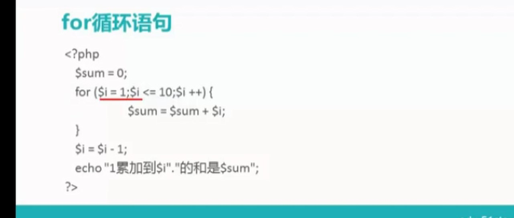

[TOC]

## if语句
```
<?php
    $username = $_REQUEST['username'];
    $password = $_REQUEST['password'];
    if($username == "admin" and $password == "123")
    {
    echo "你好,$username";
}
    else
    {
    echo "请输入正确的用户名";
    }

?>
```
## for循环


```
<?php
    $sum = 0;
    for ($i = 1;$i <= 10;$i++){
    $sum = $sum + $i;
    }
    $i = $i -1;
    echo "1累加到$i"."的和是$sum"

?>
```

## while循环
```
<?php
    $sum = 0;
    $i = 1;
    while($i <= 10){
        $sum =$sum +$i;
        $i++;
    }
    $i = $i -1;
    echo "1累加到$i"."的和是$sum"

?>
```