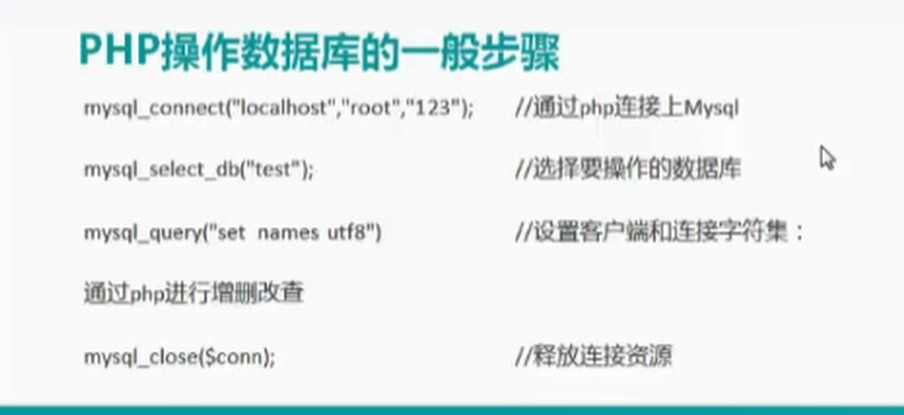
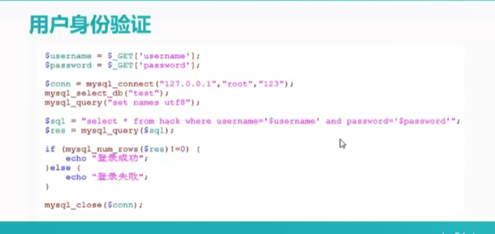

[TOC]


```
mysql_connect("localhost","root","123");    //通过php连接上Mysql,Mysql和网站在同一台服务器上，这里可以直接连接服务器自己;
Mysql_select_db("test")//打开了这个数据库之后,选择要操作的数据库(就是选择要操作mysql里面的那个数据库);
mysql_query("set name utf8")//设置客户端和连接字符集；
通过数据库进行增删改查
mysql_close($conn);//释放连接资源

```

常见的一些命令如上;


创建一个表:


## 建表
建立一个表的一般步骤:
```
1.use 数据库名
2.create table 表名
```
## 增数据
往表格里面添加数据:


## 查数据
查询数据:


现在正确的用户名和密码就两个(存于数据库里面)
而后 通过php动态网页来接收你的用户名和密码而后在数据库里面再判断你的这个用户名和密码对不对,这就是一个完整的程序.



```

$username = $_POST['username'];//这里是接收数据
    $password = $_POST['password'];
    
    $conn = mysql_connect("127.0.0.1","root","123"); //连接Mysql，并把连接的结果赋值给一个变量conn
    mysql_select_db("test");//选择打开test这个数据库
    mysql_query("set names utf8");//设置字符集
    
    $sql = "select * from hack where username='$username' and password='$password'";//在hack表里面查询符合这两个内容的:1.username='$username'，2.password='$password',由于单引号里面的数据是在双引号里面的，所以这里单引号里面的数据会被解析，他们都是文本型数据,到这里只是把查询的语句复制给这个变量，何时调用这个变量才执行这个语句;这里其实就是把要执行的语句复制给一个变量！！！
    $res = mysql_query($sql，$conn);//mysql_query这个函数式专门执行sql语句的,这句话的意思是执行存放于$sql这个变量里面的这个sql语句,并把执行的结果存于$res这个变量，$conn表示在哪个数据库连接里面执行sql语句,$res表示result，右边返回的结果是0行,1行,2行等等,通过mysql_query函数来执行上面这个语句,并把结果赋给左边这个变量``

    if (mysql_num_rows($res)!=0){
    echo "登录成功";
    }else{
    echo "登录失败";
    
    }//row:列;如果$res里面存放了不是0行,那么就证明查到结果了,这只是判断方法之一
mysql_close($conn);
```