[TOC]

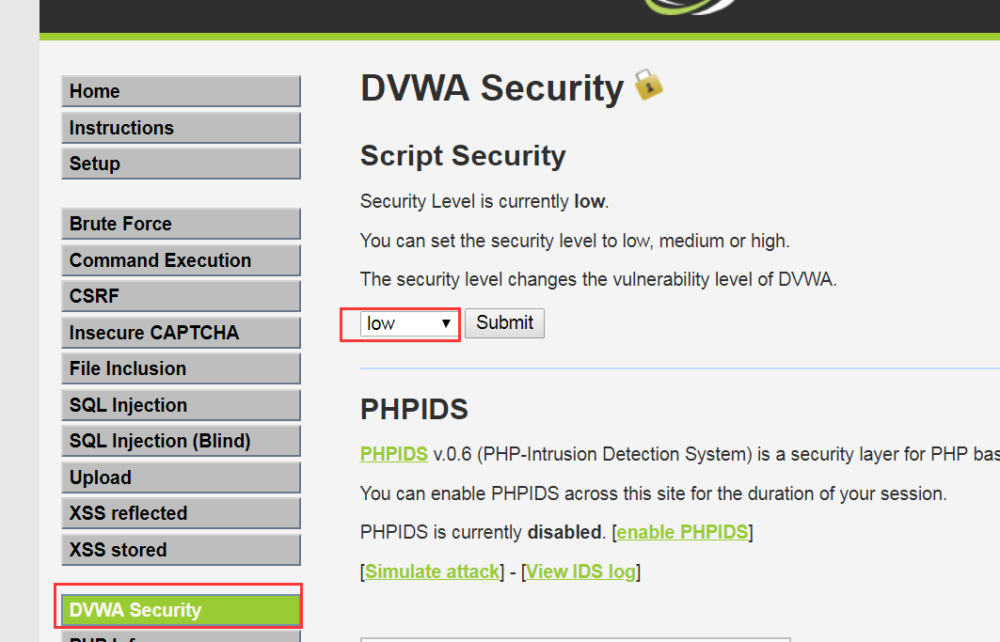

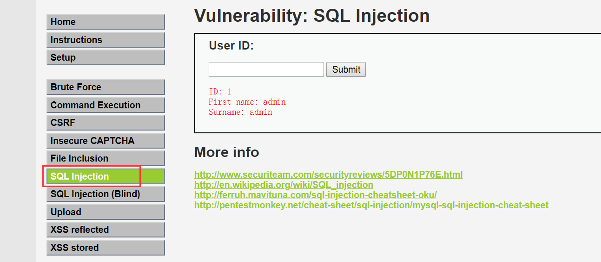
正常 情况下需要输入ID，如上图;


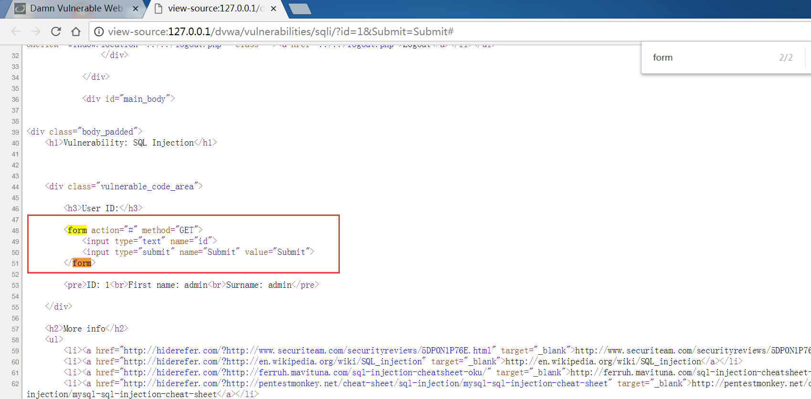
查看源码,表单里面是用于接收用户数据的;
````
        <form action="#" method="GET">
            <input type="text" name="id">
            <input type="submit" name="Submit" value="Submit">
        </form>
```
要把用户输入的数据提交给 哪个页面处理,这里是`#`，表示把数据提交给当前页面处理;
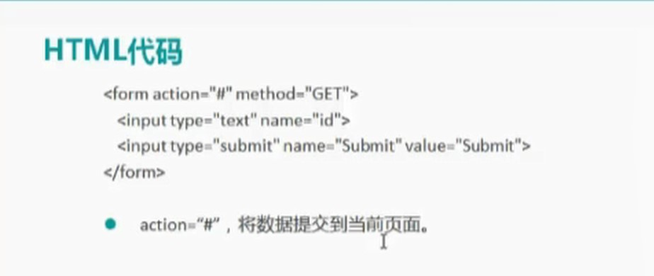
它这个页面即使让人输入用户信息的这样一个页面,输入信息以后谁来判断你的信息,对信息进行处理,它自己做,这里的method是get;一点提交,就交给当前页面处理;
下面一个关键就是找后台的来负责对我们输入的那个数据进行处理的动态网页的代码;
dvwa里面提供了这么一个功能:
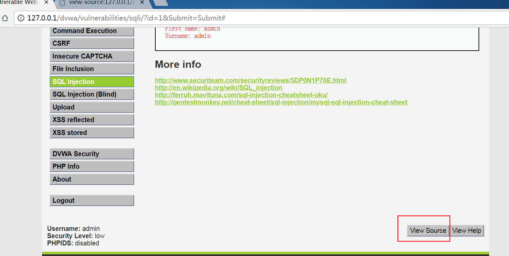

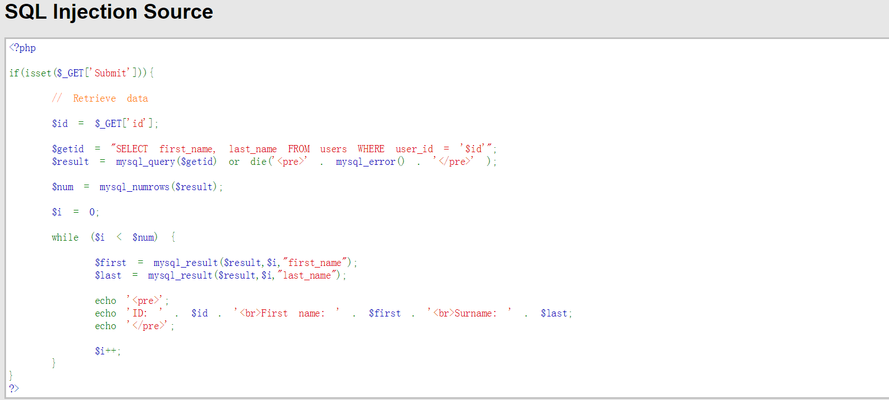

```

<?php    

if(isset($_GET['Submit'])){
    
    // Retrieve data
    
    $id = $_GET['id'];

    $getid = "SELECT first_name, last_name FROM users WHERE user_id = '$id'";
    $result = mysql_query($getid) or die('<pre>' . mysql_error() . '</pre>' );

    $num = mysql_numrows($result);

    $i = 0;

    while ($i < $num) {

        $first = mysql_result($result,$i,"first_name");
        $last = mysql_result($result,$i,"last_name");
        
        echo '<pre>';
        echo 'ID: ' . $id . '<br>First name: ' . $first . '<br>Surname: ' . $last;
        echo '</pre>';

        $i++;
    }
}
?>

```

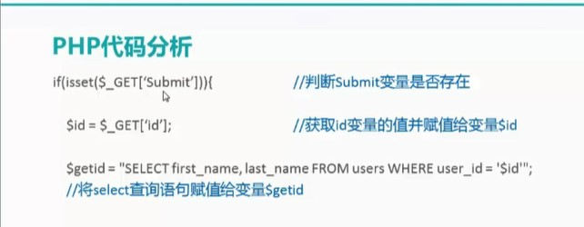
`$_GET`：它是获取 Submmit，就是看你有没有点击提交按钮,如果点击了,这里 获取的就是一个真值,如果点击了,这里就要执行大括号里面的语句,而后通过 GET方法获取在`id`这个文本框里面输入的值,而后赋值给id变量,在下面一句就是把select语句赋值给了$getid这个变量;

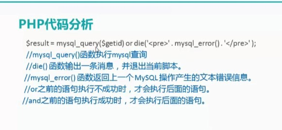
利用mysql_query执行sql的增删改查语句,而后把执行的结果发送给了result这个变量,`''`是原样输出,`.`是连接的意思，mysql_error的意思是如果前面一句Mysql_query的执行结果是错误的那么这里就会把错误的信息打印出来;
or之前的语句执行不成功,后面的语句才会执行;
and之前的语句执行成功的时候,才会执行后面的语句;
即: or : 1 or *  =1(前面执行成功了,后面可以不用看了)
and : 1 and 1 =1

mysql_query()：
如果是执行查询之类的语句(select)，那么会返回一个资源标识符,也就是我们要查找的 数据结果集;
如果执行的是增删 改之类的语句,返回的 就是true或者false了;

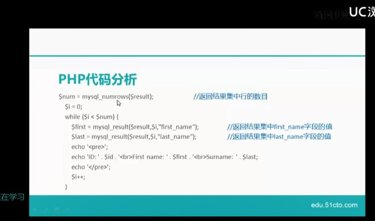
就第一句`mysql_numrows`而言，你可能查找到符合条件的有好几条记录,一条记录是一行,你通过mysql_numrows这个函数可以查到现在$result这个变量里面到底 有几行数据;
具体函数你可以看下面这里:
`http://www.w3school.com.cn/php/php_ref_mysql.asp`


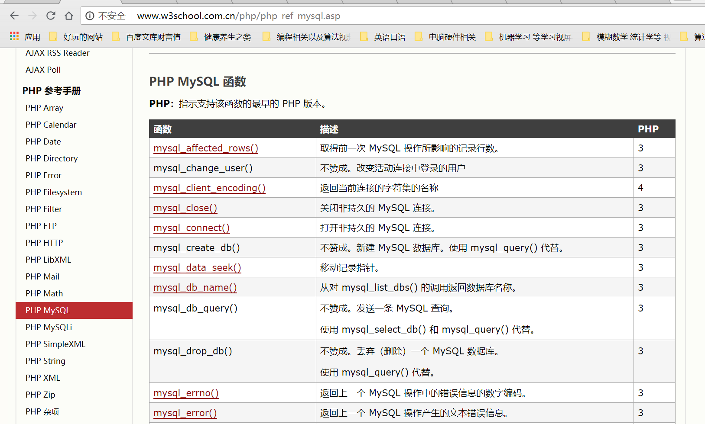


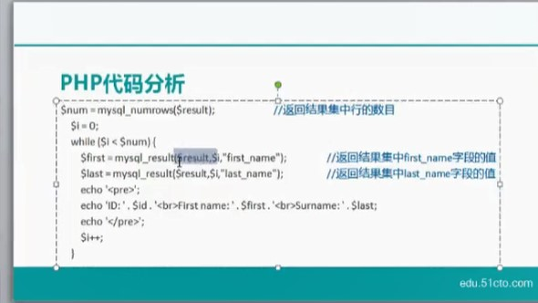
mysql_result这个是从$result这个变量里面取某个字段的值,来取哪一行呢,这里用$i表示,一开始i = 0,就要取第1行的数据,`$first = mysql_result($result,$i,"first_name");`这句话取得是first_name这个字段的值,并赋值给firdt变量,下面一句取得还是第一行里面last_name字段的值,
